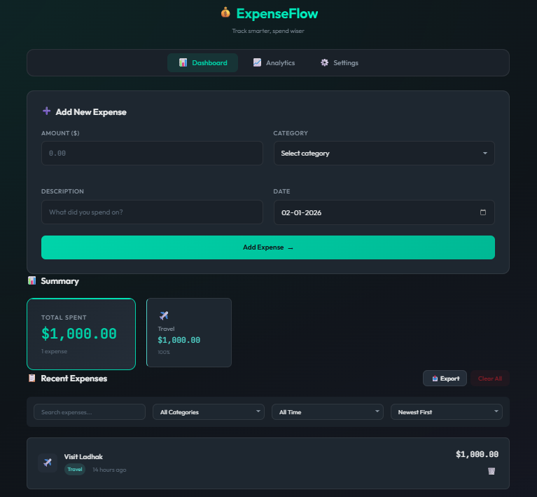
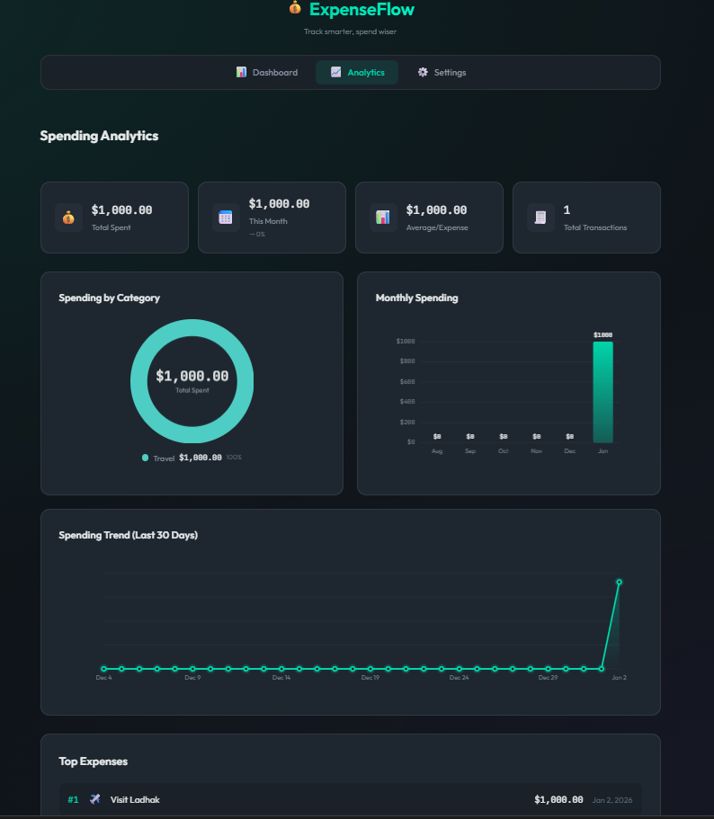
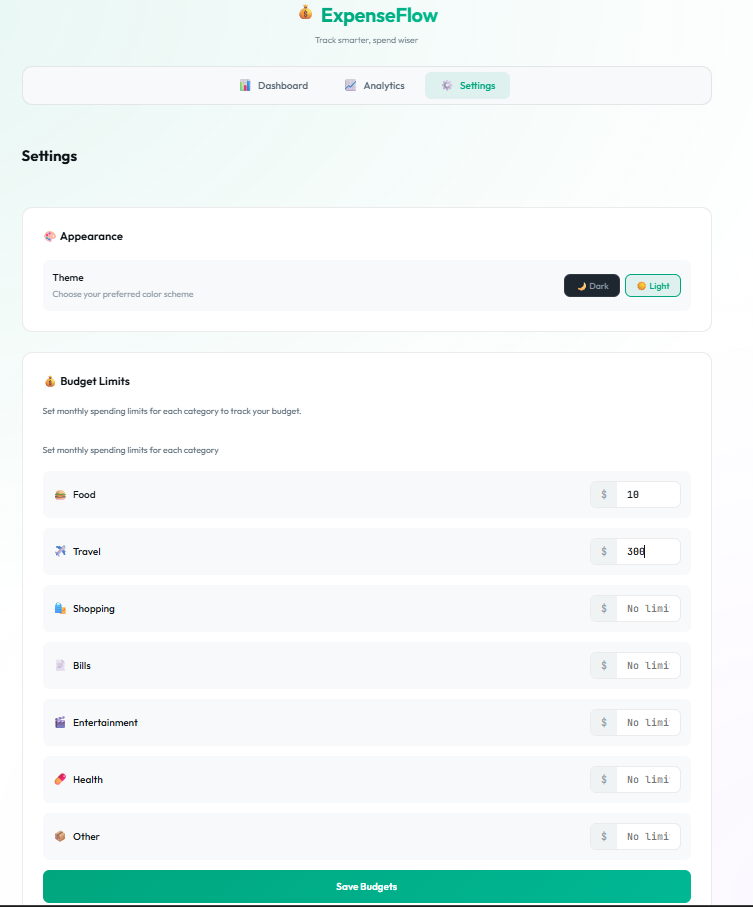
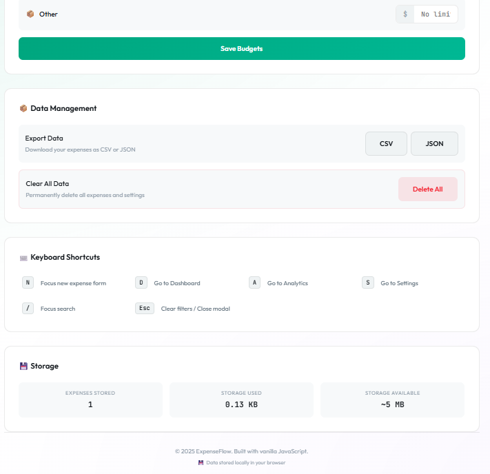

# 💰 ExpenseFlow - Smart Expense Tracker

A full-featured expense tracking SPA built with **vanilla JavaScript**, demonstrating advanced frontend skills without any frameworks or libraries.

## 🚀 Website Demo

<p align="center">
  
  
</p>

<p align="center">
  
  
</p>

## ✨ Features & Skills Demonstrated

| Feature | JavaScript Skills | CSS Skills |
|---------|-------------------|------------|
| **SPA Router** | Hash-based routing, History API, async navigation hooks | Page transitions, active states |
| **State Management** | Observer pattern, pub/sub, immutable state | Reactive UI updates |
| **ES6 Modules** | Import/export, code splitting, encapsulation | - |
| **Canvas Charts** | Canvas API, animations with `requestAnimationFrame`, data visualization | Responsive canvas sizing |
| **Local Storage** | JSON serialization, error handling, data validation | - |
| **Form Handling** | Validation, error states, dynamic forms | Shake animations, focus states |
| **Filtering & Search** | Array methods (filter, map, reduce, sort), debouncing | Filter bar layout |
| **Budget Tracking** | Data aggregation, percentage calculations | Progress bars, conditional styling |
| **Theme System** | Dynamic CSS variable manipulation | CSS custom properties, dark/light themes |
| **Export Data** | Blob API, CSV/JSON generation, file downloads | - |
| **Keyboard Shortcuts** | Event delegation, keydown handling | - |
| **Toast Notifications** | DOM creation, auto-dismiss timers | Slide animations, positioning |
| **Responsive Design** | - | CSS Grid, Flexbox, mobile-first, media queries |
| **Accessibility** | - | ARIA labels, focus-visible, reduced-motion |


## 🛠️ Tech Stack

- **HTML5** — Semantic markup, ARIA attributes, meta tags
- **CSS3** — Custom properties, Grid/Flexbox, animations, theming
- **JavaScript ES6+** — Modules, classes, async/await, Canvas API, Intl API

## 📁 Project Structure

```
├── index.html                 # SPA shell
├── css/
│   └── styles.css            # Complete stylesheet (1000+ lines)
├── js/
│   ├── app.js                # Main entry point & view rendering
│   └── modules/
│       ├── store.js          # State management (Observer pattern)
│       ├── storage.js        # LocalStorage abstraction
│       ├── router.js         # Client-side SPA router
│       ├── utils.js          # Utility functions (dates, formatting)
│       ├── charts.js         # Canvas-based data visualization
│       └── components.js     # Reusable UI components
└── README.md
```

## 🚀 Quick Start

```bash
# Clone and run (requires ES6 modules - use a server)
git clone https://github.com/yourusername/smart-expense-tracker.git
cd smart-expense-tracker

python -m http.server 8080
# Visit http://localhost:8080
```

## ⌨️ Keyboard Shortcuts

| Key | Action |
|-----|--------|
| `N` | Focus new expense form |
| `D` | Go to Dashboard |
| `A` | Go to Analytics |
| `S` | Go to Settings |
| `/` | Focus search |
| `Esc` | Clear filters |

---

<p align="center">
  <strong>Built with vanilla JavaScript — No frameworks, just clean architecture.</strong>
</p>
